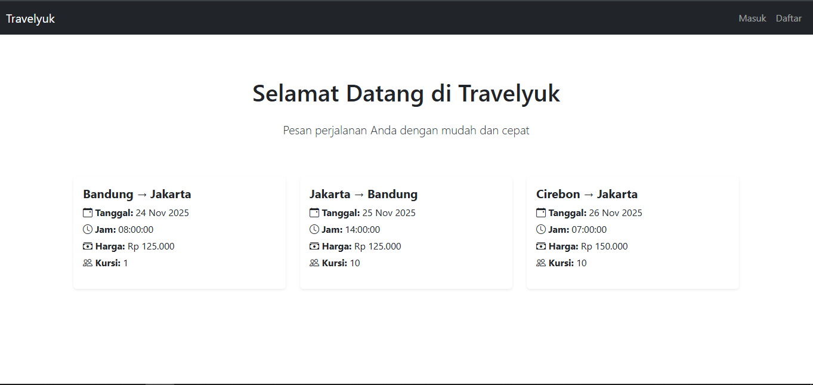
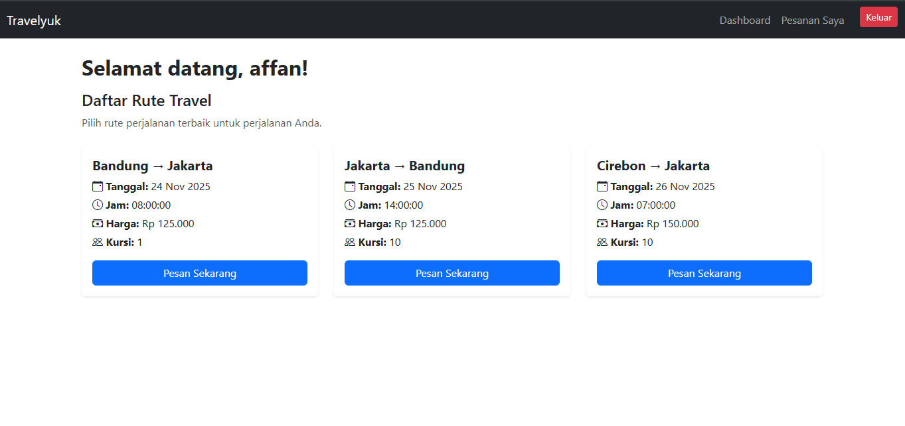
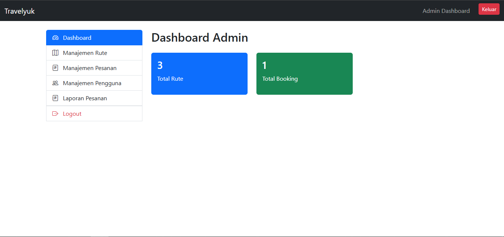

# Travelyuk

## Fitur

-   Autentikasi user (login/register) menggunakan Laravel UI Bootstrap
-   Halaman admin dan user
-   CRUD data
-   Validasi jumlah penumpang terhadap kuota kursi

## Requirement

-   PHP >= 8.1
-   Composer
-   MySQL / MariaDB

## Cara Instalasi

1. **Clone repository**

```bash
git clone https://github.com/yodantya/travelyuk.git
cd travelyuk
```

2. **Install dependensi PHP**

```bash
composer install
```

3. **Copy file `.env`**

```bash
cp .env.example .env
```

4. **Generate key aplikasi Laravel**

```bash
php artisan key:generate
```

5. **Konfigurasi database di `.env`**

-   Sesuaikan `DB_DATABASE`, `DB_USERNAME`, dan `DB_PASSWORD` dengan database lokal kamu.

6. **Jalankan migrasi dan seeder**

```bash
php artisan migrate --seed
```

7. **Jalankan server Laravel**

```bash
php artisan serve
```

8. **Jalankan Seeder Manual**

-   Jika data User dan Rute belum ada

```bash
php artisan db:seed --class=AdminSeeder
php artisan db:seed --class=RuteSeeder
```

-   Akses di browser: [http://localhost:8000](http://localhost:8000)

## Screenshot

### Halaman Utama



### Halaman User



### Halaman Admin


